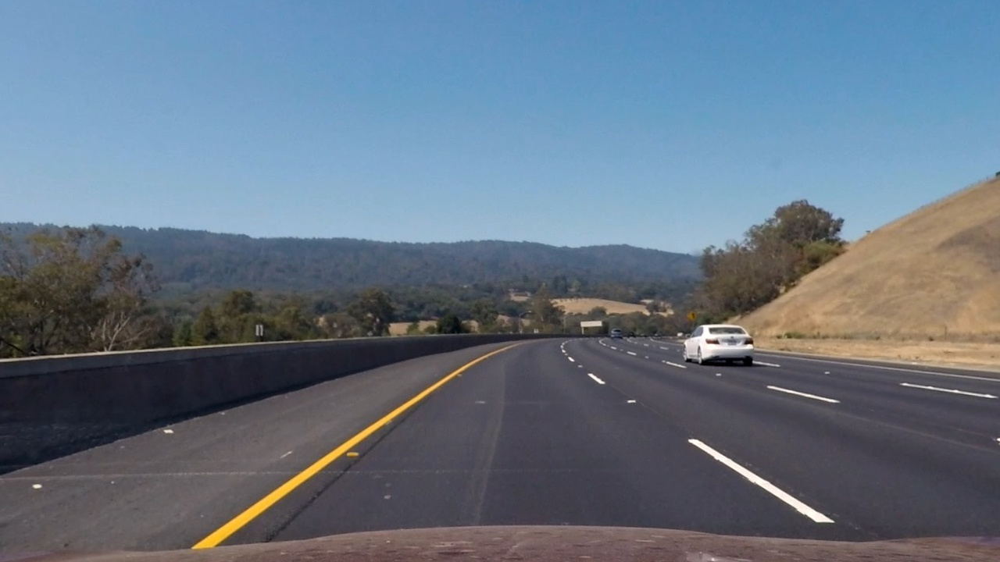
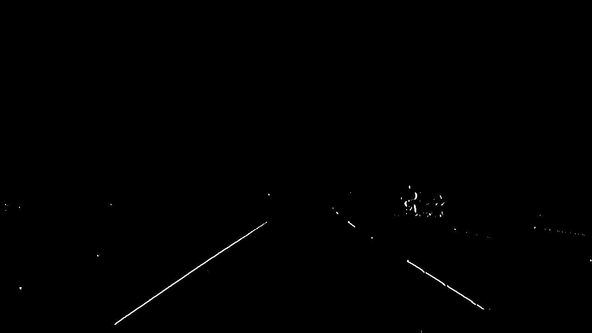
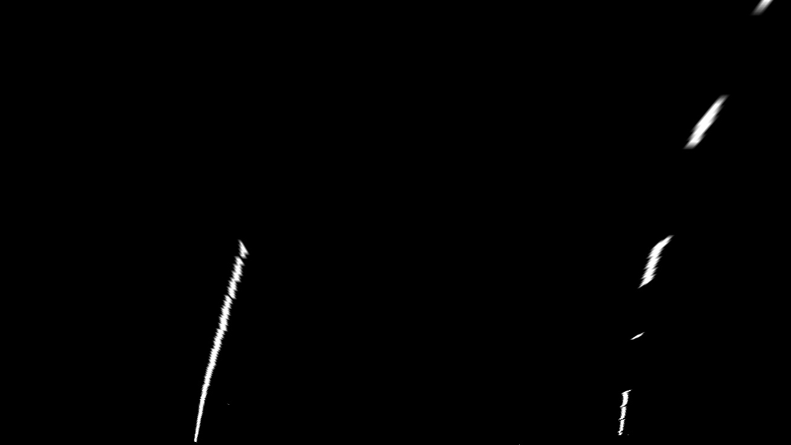
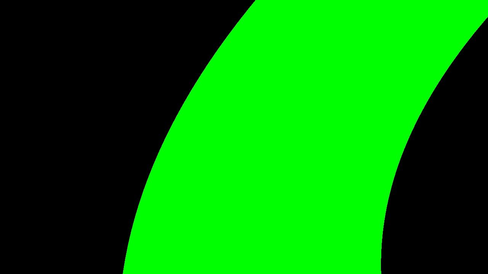
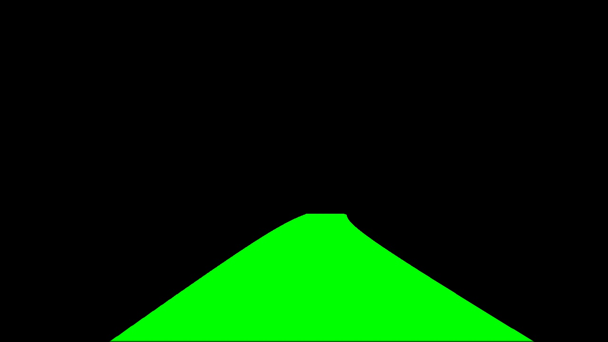
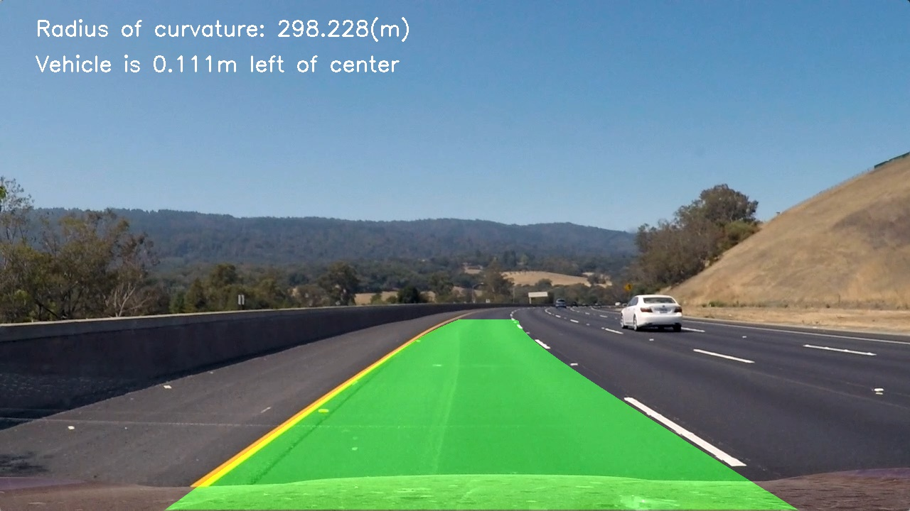

# **Advanced Lane Finding Project**

The goals / steps of this project are the following:

* Compute the camera calibration matrix and distortion coefficients given a set of chessboard images.
* Apply a distortion correction to raw images.
* Use color transforms, gradients, etc., to create a threshold binary image.
* Apply a perspective transform to rectify binary image ("birds-eye view").
* Detect lane pixels and fit to find the lane boundary.
* Determine the curvature of the lane and vehicle position with respect to center.
* Warp the detected lane boundaries back onto the original image.
* Output visual display of the lane boundaries and numerical estimation of lane curvature and vehicle position.

[//]: # (Image References)

[sample]: ./examples/test3.jpg "Pipeline"
[video]: ./output_videos/project_video.mp4 "Video"
[advLane_calib.py]: ./src/advLane_calib.py "Calibration"
[advLane_detection.py]: ./src/advLane_detection.py "Lane Detection"
[advLane_imgproc.py]: ./src/advLane_imgproc.py "Image Preprocess"
[application.py]: ./src/application.py "Application"

---

## Source Files

- [advLane_calib.py]: Contains API to calibrate camera using given sample chessboard images and save the calibration result (camera matrix, distortion co-efficient etc. as a pickle file)
- [advLane_imgproc.py]: Contains API for preprocessing images (undistort, rgb_select, hlsSaturation_select, grad_select, perspectiveTransform, inverseTransform)
- [advLane_detection.py]: Contains API for Lane detection (findWindowCentroids, polyfit)
- [application.py]: This file contains main program that will read all input files (images and videos), preprocess them, detect lane and mark on the images, calculate the radius of curvature and shift in distance from the center of lanes and save them in output folder

## Camera Calibration

### Calculating camera matrix and distortion coefficients

To calculate camera matrix and distortion coefficients, we need few sample images of chessboard pattern.
 
- Read and convert sample images of chessboard into grayscale
- Find the chessboard corners using `cv2.findChessboardCorners()` function
- Create list of image points (`objpts[]`) that maps to 2D points in the Image plane
- Create list of object points (`imgpts[]`) that maps to 3D points in the real world space. In our case we are keeping z-coordinate as zero since we are mapping a 2D image
- Feed the detected corners to `cv2.calibrateCamera()` function to get camera matrix and distortion coefficients
- Use Pickle package in python to save the calculated matrices and the no. of corners in row and col that were used to calculate the matrices on hard drive that can be used later for calibrating road images

The code for calibration is located at [advLane_calib.py]

### Pipeline (single images)

#### Provide an example of a distortion-corrected image.

1. Input Image

The input image considered is of size (720,1280,3)

2. Undistort Image

The camera matrix and distortion coefficient are read from the pickle file saved during calibration process. These matrices are fed as input to `cv2.undistort` function along with original image to remove distortion form image.

3. Color Selection

The Lanes are either White or Yellow. Thus a color selection filter is implemented to select only pixels that are either white or yellow.

To get better color selection, the image is converted to HLS color scope and Saturation (S) is selected from a predefined threshold. This would help in detecting Lanes in shadow area

The output from both merged and then fed to 
This output is then fed to Gaussian Blur filter and to sobel filter to select the gradient over x-axis

4. Image Transform

The following Source and Destination points are chosen for perspective transform the image and to get a birds eye view of the road.
src = [200, 720],
      [1100, 720],
      [685, 450],
      [595, 450]

dst = [300, 720],
      [980, 720],
      [980, 0],
      [300, 0]

5. Find Centroids
Centroid points of the lane markings are detected in the following way.
- The image is split into 4 parts.
- The sum of all pixels in y-axis is taken for the last layer
- This array is split again into two parts vertically
- A convolution operator is run over the both arrays of sum
- Index of the array with maximum value is chosen as the first centroid for left and right lanes respectively
- considering these initial centroids, further centroids are chosen in the same way as described above but this time if the new value detected is more than the margin, the last value + margin is used as the new centroid

6. Fit Curve

The centroids thus found are used to fit a curve of order 2 and as function of Y for both right and left lane markings using `np.polyfit()`. Now fill the color between the left and the right curve detected
i.e., f(y) = Ax^2 + Bx + C

7. Reverse Transform

Use cv2.warpPerspective function. This time inverse perspective transform matrix is used by feeding src and dst points in reverse order.

8. Measure Car position with respect to the center of lanes and radius of curvature and final overlay

---

### Pipeline (video)

#### 

For Videos, apart from the pipeline used for lane detection in images, the list of centroids detected from frames are pushed into a circular buffer and for the current image under detection, the circular buffer is averaged with the new centroids detected. This is done to avoid wobbling of lanes and keep them steady

---

### Discussion

#### Problems / issues you faced in your implementation of this project.

##### - Color and Gradient Detection

The color selection can be improved with better threshold to detect White and Yellow lanes separately which can be used in making decisions (identifying construction zone for egg. in some countries)
Also the accuracy of selecting color can be improved if we detect both colors separately and merge them with the saturation value to increase the confidence.

Gradient detection can be improved by taking both magnitude and direction of the gradient for colors that are detected which will help in reducing noise level

##### - Perspective transform

Currently I am taking fixed points for perspective transformation. This can be made dynamic by detecting horizon and also point of convergence. This will help even if the camera positions are changed.
